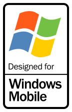
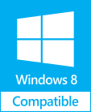
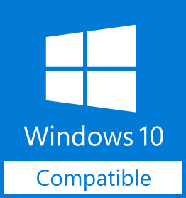

<a href=https://github.com/C0m3b4ck/BookwormPascal/blob/main/README_PL.md>🇵🇱🇵🇱🇵🇱🇵🇱🇵🇱POLSKA WERSJA🇵🇱🇵🇱🇵🇱🇵🇱🇵🇱🇵🇱</a>
 
 <b>🇪🇺🇪🇺🇪🇺Made in Europe🇪🇺🇪🇺🇪🇺</b>
 
# BookwormPascal
Version of the library management program Bookworm but in Pascal.
 <b>For the still actively maintained Visual Basic 6 version, visit <a href=https://github.com/C0m3b4ck/Bookworm-VisualBasic> here.</a></b>
 <b>For the unsupported, broken Python version, visit <a href=https://github.com/C0m3b4ck/Bookworm> here.</b></a>

# Help!!! Which one do I download????? 🤔🤔🤔
<h3>Don't worry, I do make a lot of different builds and it's easy to get confused!</h3>
<h2>  <b>💼 Portable</b> - a single <i><u>compressed folder</u></i>, just download, extract and run <b><i>BookwormPascal.exe</i></b> </h2>
<h2>  <b>📦 Installer</b> - a single <i><u>.exe file</u></i>. When you run, it shows a menu, including installation location etc.</h2>
<h1>Before downloading, check your architecture: </h1>
<h2>x64_8-11_MODERN - supports Windows 8 x64, Windows 8.1 x64, Windows 10 x64, Windows 11 x64. If you do not know which Windows version you are using, use this build.</h2>
<h2>x64_Linux - supports x64 versions of Linux (definitely Ubuntu and Debian)</h2>
<h2>x32_Linux - supports x32 versions of Linux (definitely Ubuntu and Debian)</h2>
<h2>x86_XP-Vista-7 - supports Windows XP x86, Windows Vista x86, Windows 7 x86.</h2>
<h2>x64_XP-Vista-7 - supports Windows XP x64, Windows Vista x64, Windows 7 x64.</h2>
<h2>x86_9x_attempt - supports Windows 98, Windows 95 is currently being attempted.</h2>
<h2>ARM_CE-4-5-6 - supports Windows CE 4, 5 and 6 on ARM architecture.</h2>
<h2>x96_CE-4-5-6 - supports Windows CE 4, 5 and 6 on x86 architecture.</h2>

# Author
Started on February 28th, 2026 by C0m3b4ck.
 Inspiration from Marek Ryński, the author of Bibliotekarz .NET - https://bibliotekarz.net/

# TO-DO pre-1.0

<h2>Done: </h2>
 * Every GUI needs to be finished, even if non-functional - <b>DONE April 2nd, 2026</b>
 * CRUD needs to be done - the program is dependent on databases after all, could also use .txt files for configs etc. -<b> DONE April 7th, 2026</b>
 * Hashing function used during registering and logging in - <b>DONE April 10th, 2026</b>
<b>
<h2>To-do:</h2>
 * Fix all critical bugs (currently: 1)
 * Every form and tabsheet needs to clear all text fields upon being closed
</b>

# TO-DO post-1.0
<b>
 * Adding encryption to databases (especially readers)
 * Backup making
 * P2P communication with local/remote devices for backups
 * Every GUI's items need to resize with window (will probably implement using anchors)
</b>

# Known Bugs
<b>
 * password does not auto-hide in login form [CRITICAL]
</b>

# 3rd party requirements
<b>
* self-built variations of sqlite3.dll (x86), sqlite3.dll (x64) and sqlite3.dll (ARM)
</b>

# Supported OSes

 The badges are meant to represent compatibility. For this reason, no badges with the word "certified" have been used. This project is not endorsed nor certified by Microsoft.
Downloaded from https://logos.fandom.com/wiki/Microsoft_Windows/Compatible
 <h2><b>Compiled versions:</h2> 
 x32 NT (Windows 2000+ using FPC 3.0.0), 
 x32 9x (Windows 95, 98 and Me using FPC 2.4.4), 
 x86 Linux,
 x64 Linux (Ubuntu as main focus),
 x64 NT (Windows XP+ for x64)
 ARM (FPC 2.4.4 and 3.0.0 for different CE versions) (no sound due to uoslib incompatibility)
</b>

 <h2><b>Supports all versions of Windows, from Windows 95 up to Windows 11:</b></h2>

    Windows 95 (requires the use of FPC 2.6.4 or older, has its own separate version)

    Windows NT 4.0

    Windows 98 

    Windows 98 SE

    Windows 2000

    Windows Me

    Windows XP (tested: x86, x32 and 64-bit, Home, Professional, includes: Starter, Tablet PC, Media Center, Embedded)

    Windows Server (all versions including 2003, Small Business Server 2003, 2003 R2, Home Server,
    2008, Small Business Server 2008, 2012, 2012 R2, 2016, 2019, 2022, 2025)

    Windows Embedded versions, including: Windows Embedded for Point of Service, Windows Embedded Standard 2009, Windows Embedded POSReady 2009

    Windows Vista

    Windows 7

    Windows 8

    Windows 8.1

    Windows 10

    Windows 11

    (probable future desktop OS from Microsoft)

 <b><h2>Possible support via ARM compilation:</h2></b>

    Windows CE (including versions 4, 5, 6, .NET 4.1, .NET 4.2, 7, 2013)

    Windows CE for Automotive

    Pocket PC (including versions 2000, 2002)

    Windows Mobile

 <b><h2>Will not be supported: </b></h2> 

* All Xbox OSes
* Windows CE 1.0, 2.0 and 3.0 (requires DOS-like C compilation)
* MS-DOS and Windows versions older than Windows 95 (3.1, 1 etc.)

# Principles
* Maximum speed, ease-of-use and efficiency
* Privacy - encrypted databases for users without correct credentials
* Easy installation and portability - no dependencies need to be manually installed by user
* Overall user convenience and ease of use, yet advanced management for admins and superadmins
* Past, present and future compatibility with Windows

# Why?
* Visual Basic 6 works very badly on Windows 95,
* VB6 only compiles to x32, requiring WoW64 on modern Windows
* VB6 is hard to debug (barely any debugging upon compilation). The native mode does not allow for catching errors (like Python's JIT), but Pascal catches 99% of errors during compilation
* Pascal can be compiled and distributed without any dependencies

# Screenshots
<h3>Windows 95</h3>

<h3>Windows 98</h3>

<h3>Windows 2000</h3>

<h3>Windows XP</h3>

<h3>Windows 7</h3>

